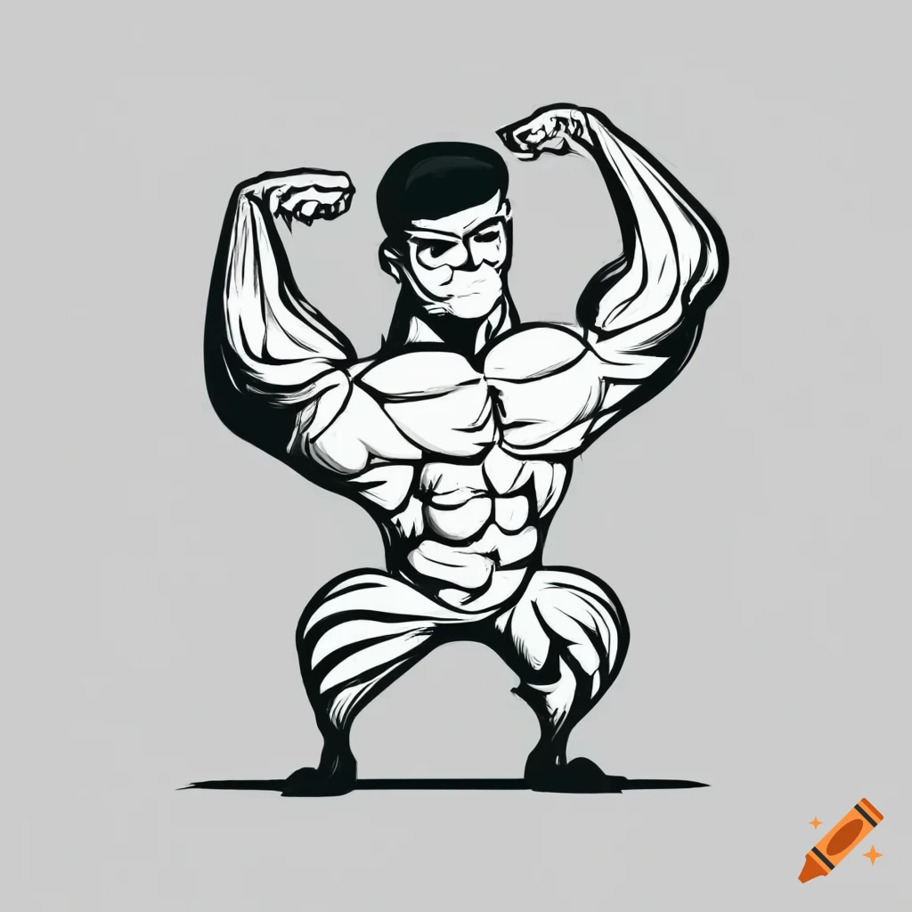
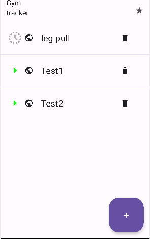
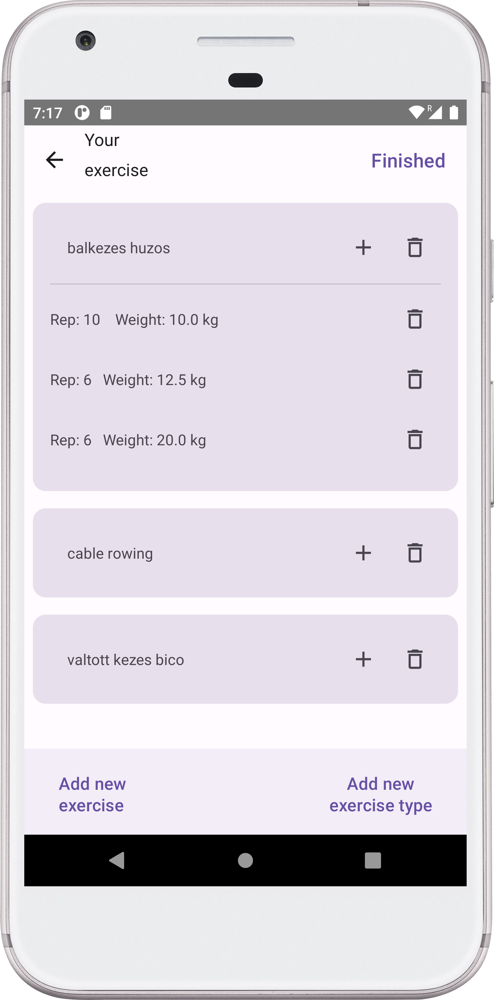
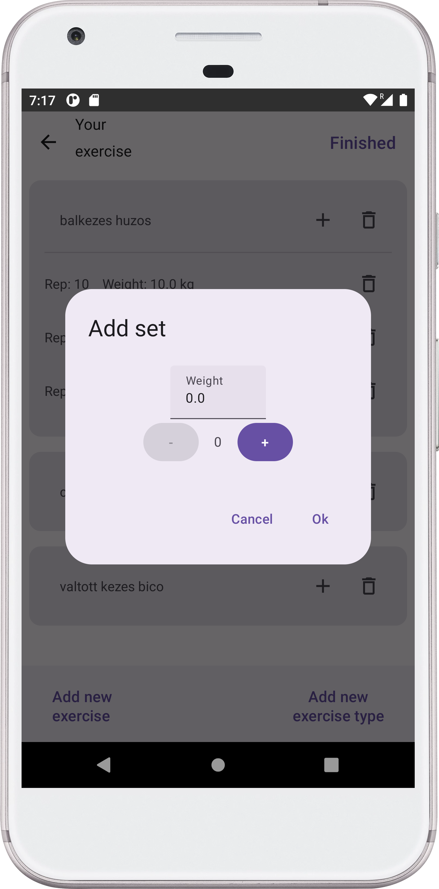
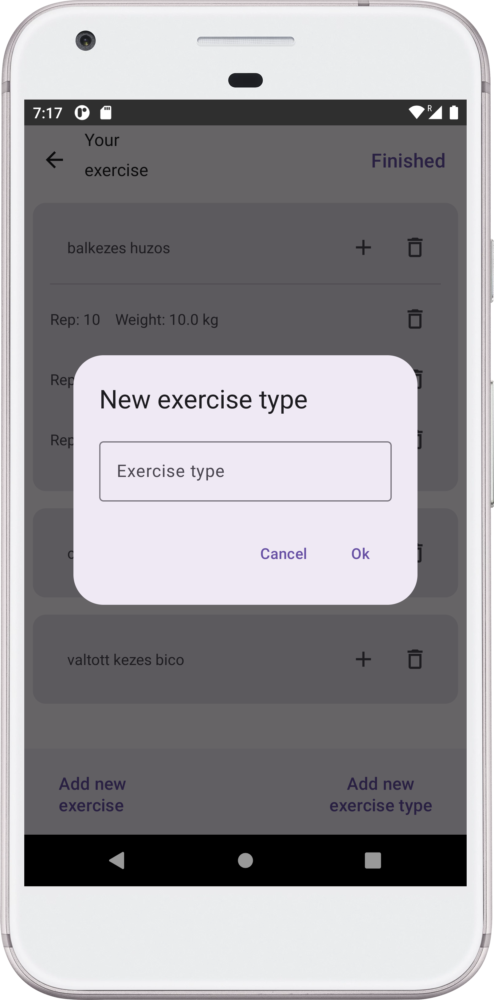
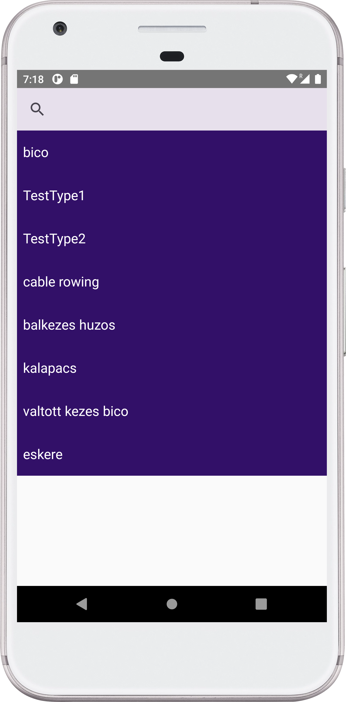
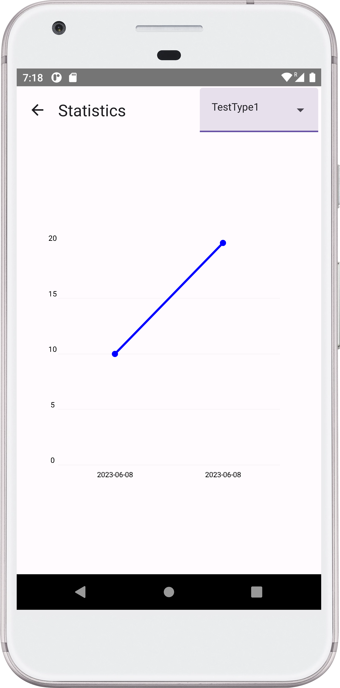

# Házi feladat specifikáció

Információk [itt](https://viauav21.github.io/laborok/hf)

## Androidalapú szoftverfejlesztés
### [2023. 04. 25. - 2023 1. félév]
### [Petruska Bence] - ([JP5JDU])
### [bence.petruska@gmail.com] 
### Laborvezető: [Pomázi Krisztián]

## Bemutatás

Az alkalmazás neve Progress Tracker, ami az edzéseink során jön jól. Amint elkezd az ember konditerembe járni, rájön, hogy egyre nehezebb a teljesítményünket követni, ebben segít az alkalmazás
Miből? Mennyit? Hányszor? Mikor? Ezeket a kérdéseket edzés közben pihenések között megválaszoljuk és az alkalmazás elmenti nekünk. 

## Főbb funkciók

Az alkalmazás körülbelül 3-4 főnézettel és pár alnézettel fog rendelkezni.
Az alkalmazást elindítva a **History nézet** a folyamatban lévő / befejezett edzések listája jelenik meg. Ebben a nézetben indíthatunk el új edzés "session"-t is. 
A **History nézetben** lehetőségünk van egy térkép megnyitására is, amiben látható, hogy hol edzettünk.
A listában egy edzésre rákattintva megjelenik az **Edzés nézet**, az adott edzéshez tartozó elvégzett gyakorlatok listája. Hozzáadhatunk illetve törölhetünk gyakorlatokat a nézetben, illetve szintén rákattinthatunk listaelemekre, ahol módosíthatjuk a súlyokat és ismétlést is.

A **History nézet** mellett található egy **Progress nézet**, amiben egy jetpack-compose chart library használatával kirajzolódik egy csinos kis grafikon az előrehaladásunkról.
Ebben a nézetben adhatjuk meg a súlyunkat is, amit szintén nyomon fog tudni követni így az applikáció.

Az alkalmazás perzisztensen fogja tárolni az adatokat **Room**-al.
A chart library valószínűleg ez lesz: [https://github.com/hi-manshu/Charty](https://github.com/hi-manshu/Charty) (de ez még változhat)
Az edzéshez elmentődik az edzés lokációja is és a dátum.
## Választott technológiák:

Az alkalmazás fejlesztése során használt technológiák tételes felsorolása. Az, hogy mi számít technológiának a laborokon ismertetésre kerül, a laborvezetőkkel tovább pontosítható. 
5 technológia használata javasolt. Például:

- UI: A felhasználói felület Jetpack Compose-ban és MVVM architektúrával.
- lista: Több listanézet: edzések, gyakorlatok, ismétlések... 
- Téma: A chart-hoz: [https://github.com/hi-manshu/Charty](https://github.com/hi-manshu/Charty) 
- Adatbáziskezelés: A felhasználó adatai elmentődnek.
- Pozíciómeghatározás: Az alkalmazás követi a pozíciónkat

___

# Házi feladat dokumentáció

### [GymProgress]

## Bemutatás

Idén elkezdtem konditerembe járni és egy-egy embernél láttam egy olyan alkalmazást, amivel követni tudták a teljesítményüket.
Innen jött a terv, hogy akkor csinálok magamnak egy ilyen alkalmazást az én igényeimre szabva.
Az alkalmazással követni tudjuk az előrehaladásunk.

## Főbb funkciók

Az alkalmazással fel tudunk venni egy edzés "session"-t, abba gyakorlatokat rakni, a gyakorlatokba pedig ismétlés számot a súllyal együtt.
Továbbá lehetséges a fejlődésünket vizuálisan megjeleníteni. 
A gyakorlatok neveit nem hívja mindenki ugyanúgy, ezért saját típusokat definiálhatunk.

Tervben volt, egy megoldás, hogy a helyszín is elmentődik a dátum mellett, ez végül nem valósult meg.

## Felhasználói kézikönyv

Az alkalmazás indulásakor a főmenüben találjuk magunkat, ahol felsorolódnak a Session -k, amiket létrehoztunk. 
A Session lehet aktív vagy finished, ezt a zöld nyíl vagy az óra jelzi.
A plusz gombbal létrehozhatunk egy session-t, a kuka gombbal törölhetjük.

A felső navigációs menüben a "csillag" gombbal navigálhatunk a statisztika nézetre

1. ábra: Főmenü kinézete

A Session-re rákattintva átnavigálunk a Session nézetére. Itt a Session-höz tartozó gyakorlatok.
A gyakorlatok kártyák, amikre rákattintva kinyílnak és akkor megjelennek alatta a az ismétlések a súlyokkal együtt.
A felső menüben visszanavigálni tudunk vagy finished-re átállítani az edzést.

2. ábra: A gyakorlatok és benne az ismétlések felsorolva.

A kártyán lévő + gombbal hozzá tudunk adni az adott gyakorlathoz egy újabb ismétlést az alábbi felugró ablakban.

3. ábra: Az ismétlés hozzáadó ablak.

Az alsó navigációs menüvel létre tudunk hozni egy új feladat típust. 
A felugró dialógus ablakba beírva a feladat nevét, az hozzáadódik egy listához és az innentől kezdve meg fog jelenni a feladat típus kiválasztóban.

4. ábra: A feladat nevét a felugró ablakba kell csak beírni.

Ha a másik navigációs gombra kattintunk, átkerülünk a feladat létrehozó menüben. 
Itt tudjuk kikeresni a következő feladat nevét és arra rákattintva visszanavigálódunk a Session nézetre.

5. ábra: A keresőmezőbe beírt kifejezés szűkíti a találatok számát

A statisztika nézetben a felső leugró menüben ki kell választani a felajánlott feladatokból. Arra kattintva frissül a statisztika
A statisztika y koordinátája az adott edzés adott feladatához tartozó max súly, az x koordináta pedig az dátuma az edzésnek.
Így könnyen nyomon tudjuk követni az előrehaladásunk.

6. ábra: A felső leugró menüben tudjuk kiválasztani az általunk már létrehozott feladat neveket

## Felhasznált technológiák:

Itt kell felsorolni minden technológiát, technikát, külső könyvtárat, komplexebb algoritmust, ami növeli az alkalmazás értékét. Osztályzáskor ezt a fejezetet nézzük meg először.

Külső osztálykönyvtár használata esetén a könyvtár neve legyen link, ami annak elérhetőségére mutat.

A kulcsszavak legyenek **félkövér** betűtípussal szedve.
Például:

- •	Az X és Y képernyők optimalizáltak **álló és fekvő nézetre** is
- [YCharts](https://github.com/yml-org/YCharts) osztálykönyvtár használata a grafikonok rajzolására
- **Fused Location API** használata helymeghatározásra
- **SQLite** alapú adattárolás
- Implicit intent használata **QR kód beolvasáshoz** (telepített Barcode Scanner alkalmazás szükséges a futtatásához)
- A játék fizikáját a [Box2D](https://box2d.org/) motor biztosítja
- **Service** használata zenelejátszáshoz

## Fontosabb technológiai megoldások

**A számodra legnehezebb/legérdekesebb funkciót fejtsd ki kb.  10 mondatban, hogy mi volt a probléma és hogyan oldottad meg.**